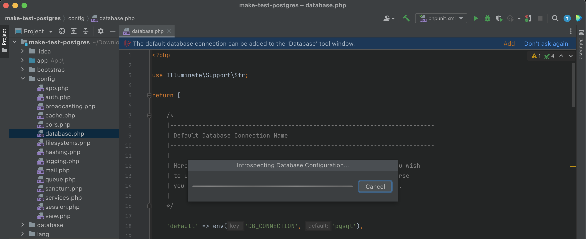

# Managed Data Sources for `default` Laravel Database Connection

PhpStorm includes a suite of [database management tools](https://www.jetbrains.com/help/phpstorm/relational-databases.html). Each database connection is called a _data source_, which can be used to provide autocompletion for SQL code and inspecting the schema or rows of your database tables.

As we already have to configure our database connections in Laravel using the `.env` and `config/database.php` files, Laravel Make can **automatically create and manage a data source** based on the currently configured database. More specifically, this will be the one that is used by the `DB` facade and your Eloquent models by default. 

When you open the `config/database.php` and installed the extension, you will see a banner at the top of the file:

This signals, that Laravel Make correctly identified the Laravel application in your project. If you click `Add`, or alternatively manually trigger the `Autoconfigure Default Database Connection` action, a progress bar will open, and Laravel Make will read your current database configuration as it would be returned by executing `config('datbase')` when using Laravel Tinker. This might take a few seconds, if you are using Docker, but otherwise should be pretty quick.

After this is completed, the `Database` tool window opens from the right and now includes a new `Laravel` entry, which is connected to your database. It might be necessary to download additional JDBC driver files, so PhpStorm is able to connect to the database, but the IDE will guide you through the process, which only takes a few clicks and only needs to be done once.

If the connection was successful and all driver files are present, you can explore the contents of your database as seen on the screenshot below:

As you may have noticed, the banner at the top still remains. It now can be used to update the managed data source, when the database configuration changes. If you don't like the banner, you can always hide it by clicking on `Don't ask again` or unchecking the corresponding checkbox in the plugin settings.

Right now the schema of a data source does not update automatically, so you may need to refresh the database tables from time to time (e.g. after running `php artisan migrate`). You can learn more about the specific features of the `Database` tool window from the [official PhpStorm Database & SQL documentation](https://www.jetbrains.com/help/phpstorm/relational-databases.html).
