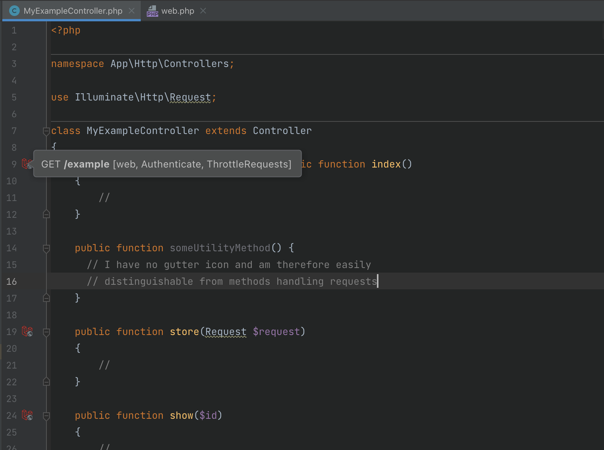

# Route Action Icons

Some methods in your controllers are _special_, as they handle incoming HTTP requests. They have a certain path and middleware attached to them, which is not directly obvious without context. Laravel Make marks methods registered as [route actions](https://laravel.com/docs/controllers) with a small gutter icon:

This makes them stand out from normal methods that might be present on your controller classes. As a bonus, you can hover over an icon to see related information:

- the HTTP verb
- the URL path pointing to that endpoint
- additional middleware applied to the route

If you don't like the icons, they can be disabled in the settings under "Editor > General > Gutter Icons > Laravel Make".

## Notes

This feature is still relatively new, so some things might work as reliable as other features of this plugin. The data used to display the icons is the same one as used for the [routes tab in the Laravel tool window](tool-windows.md#routes), so the same restrictions and possible staleness of the data applies.