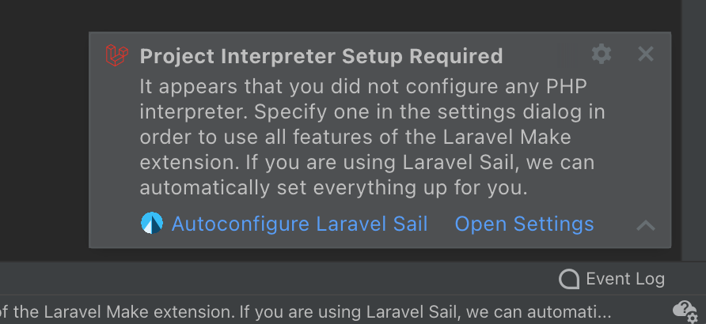
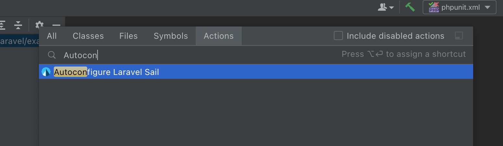
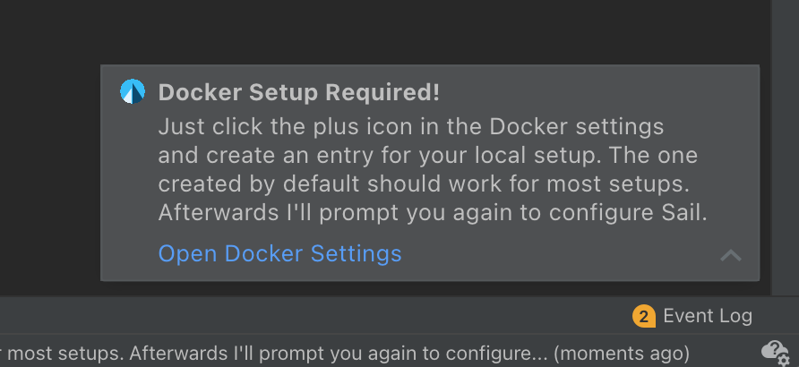

# Laravel Sail Autoconfiguration

PHPStorm provides multiple integrations for PHP and NodeJS. You can [run tests via gutter icons](https://www.jetbrains.com/help/phpstorm/using-phpunit-framework.html), set breakpoints and [debug your PHP scripts](https://www.jetbrains.com/help/phpstorm/debugging-with-phpstorm-ultimate-guide.html) or run npm scripts with easily discoverable GUI elements. All of these features work magically if you are using _local_ development tools that exist on your system.

However, the official ["Getting Started"](https://laravel.com/docs/9.x#your-first-laravel-project) section of the Laravel documentation describes the setup using Laravel Sail, which uses Docker and container technology under the hood, so you don't need to manually install PHP, Node, etc. on your computer. While this greatly reduces the maintenance burden and gets you up and running quickly, most of the nice IDE features provided by PHPStorm now don't work out-of-the-box.

To make things easy again, Laravel Make provides a way of automatically teaching PHPStorm to use the `php`, `node` and `npm` binaries inside Sails containers instead of the ones that may be locally installed on your computer.

## Using the Autoconfiguration

Whenever you open a Laravel application, and this plugin cannot use the projects PHP interpreter (e.g. you don't have `php` installed on your computer), you'll see a notification like this:

As you can see, you can either run the Laravel Sail Autoconfiguration or manually configure everything. Note that the Autoconfiguration is only available, if the following applies:

- Your composer dependencies are installed
- `laravel/sail` is listed in your `composer.json`
- Your project has a `docker-compose.yml` at its root
- The `docker-compose.yml` contains a `laravel.test` service

All applications created using the approach described in the official ["Getting Started"](https://laravel.com/docs/9.x#your-first-laravel-project) Documentation adhere to these constraints, so most projects should be automatically configurable.

If you missed the notification or changed the settings and want to restore the automatically configured ones again, just <kbd>CTRL+SHIFT+A</kbd> (or <kbd>CMD+SHIFT+A</kbd> on Mac) and search for "Autoconfigure Laravel Sail".

## Initial Docker Configuration

Depending on your settings, you may see another popup when applying the autoconfiguration:

This is a one-time configuration you may need to set up, as the IDE does not yet know how to talk to the Docker daemon on your system. The link provided by the notification should take you to the Docker setting, where you can easily add an entry for your local Docker installation.

After setting up your local Docker connection and hitting either "Apply" or "Save" in the settings dialog, you'll again be prompted regarding the Sail Autoconfiguration.
