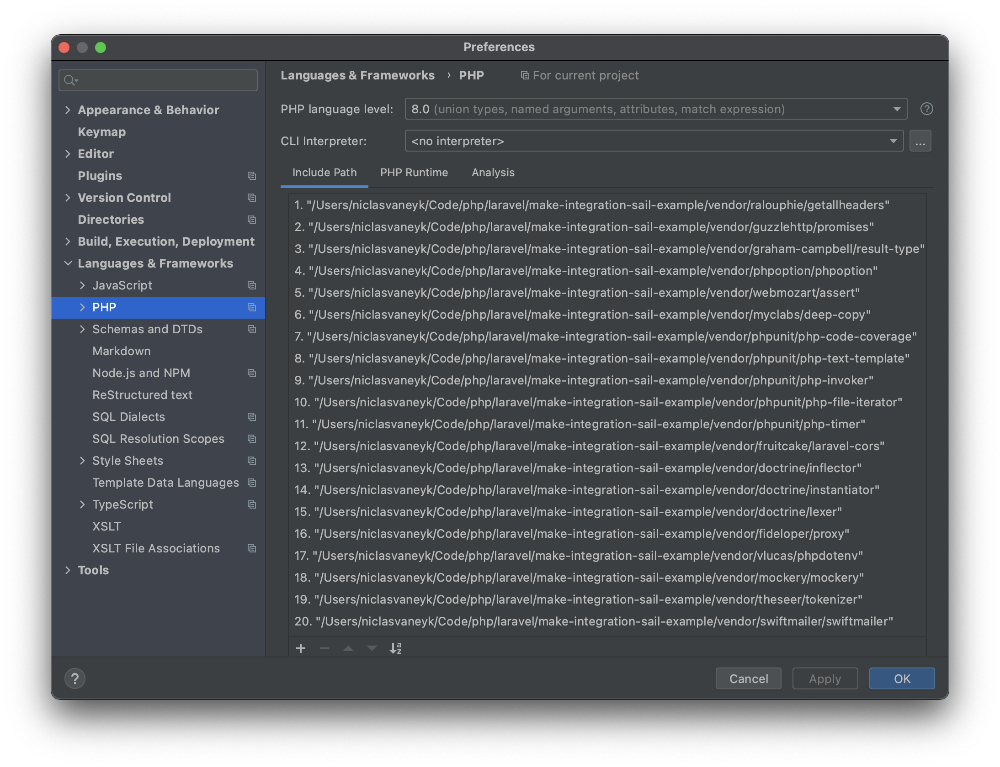
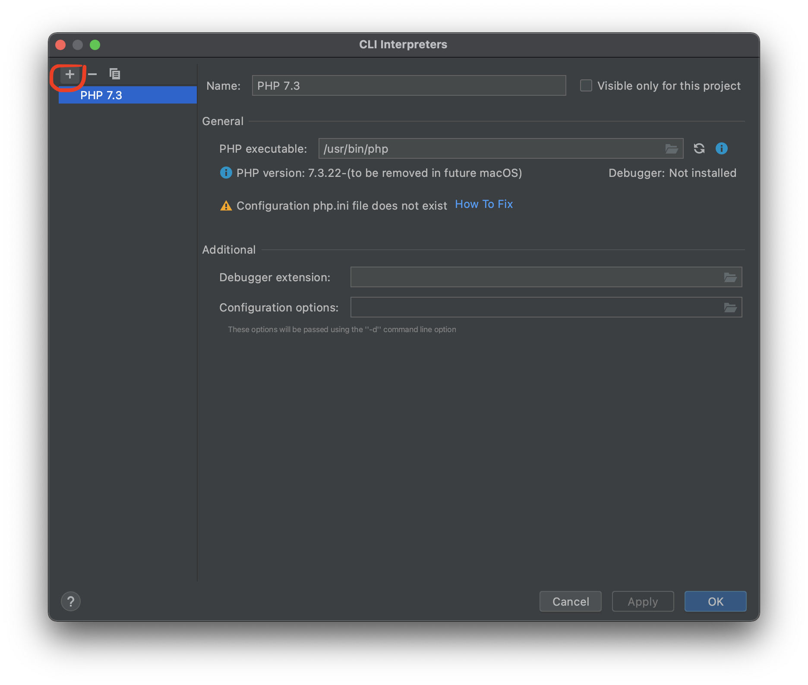
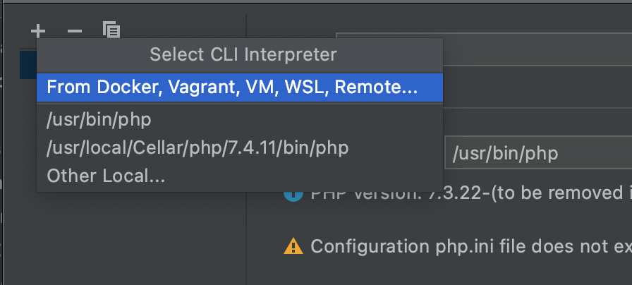
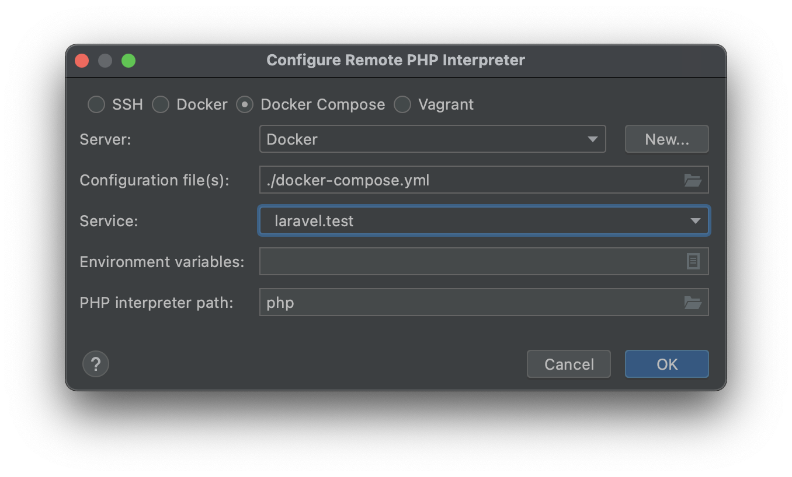
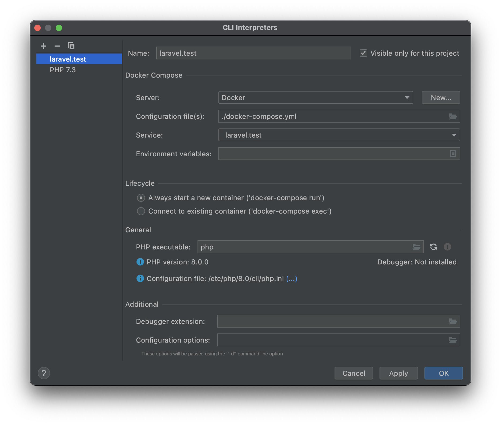
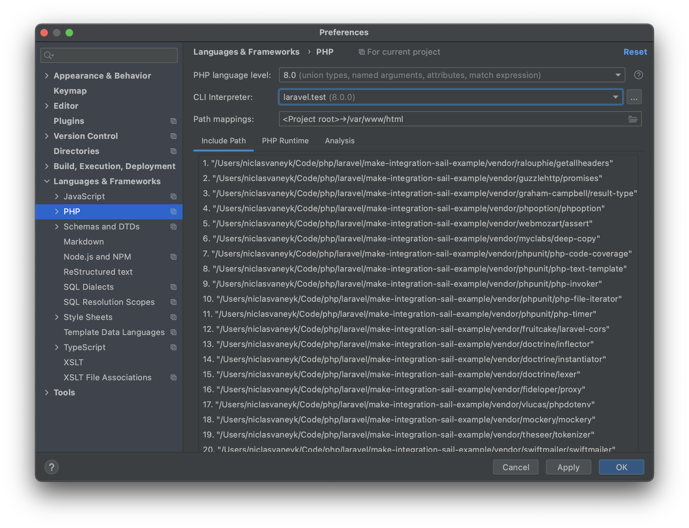
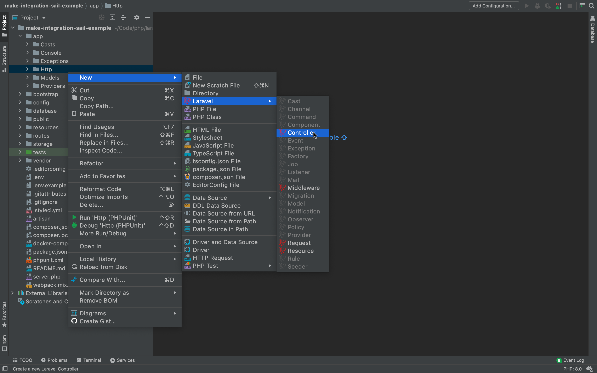
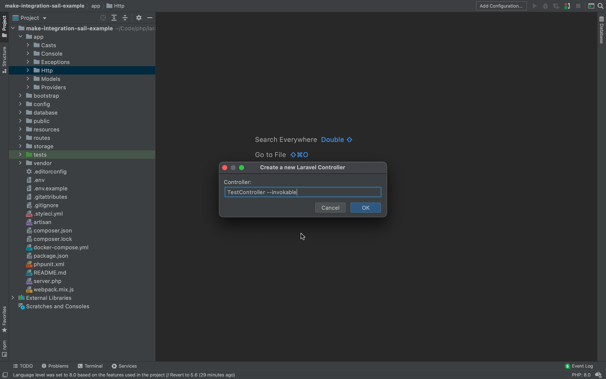
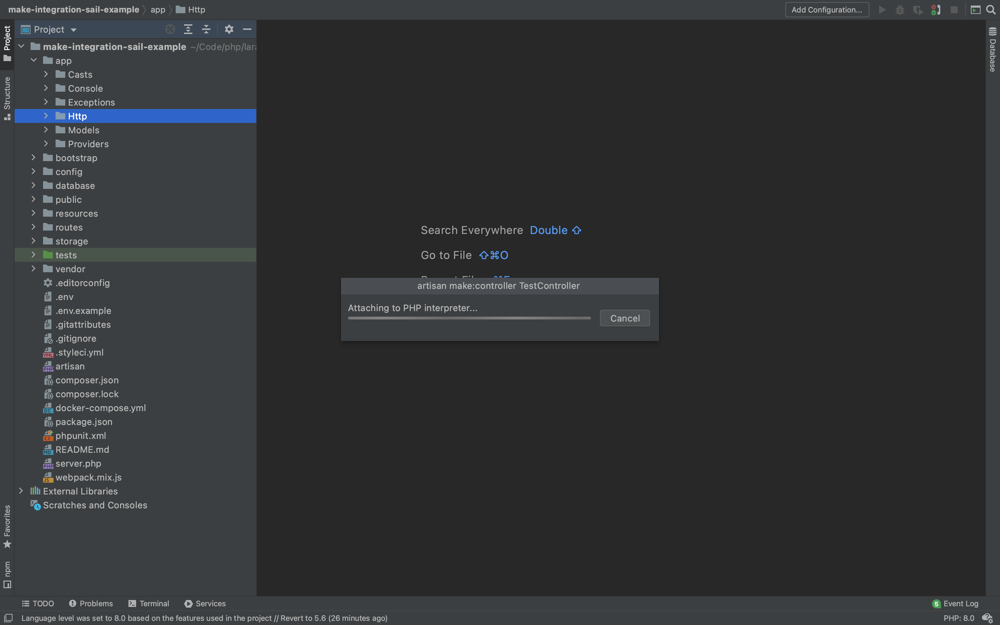
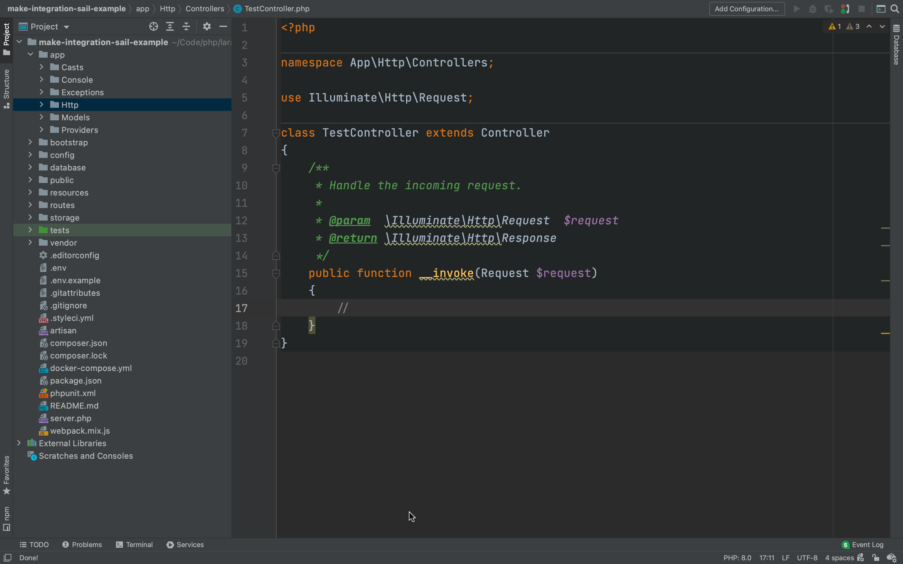

# Setup example with Laravel Sail ⛵️

We will walk through the process of creating a new Laravel application using Laravel Sail as our local development environment and connecting it to PHPStorm.

## Prerequisites

I assume you already have the PHPStorm, the [plugin](https://plugins.jetbrains.com/plugin/14612-laravel-make-integration) and docker installed.

## Creating the project

For now we are just following the [setup instructions from the official docs](https://laravel.com/docs/8.x/installation#your-first-laravel-project) (adjust this for your system):

```shell
curl -s https://laravel.build/make-integration-sail-example | bash
```

This will download the a php docker image, install a few composer packages and create a fresh Laravel application under `./make-integration-sail-example`.

Now enter our newly created directory containing our app

```shell
cd ./make-integration-sail-example
```

and starting the necessary services using

```shell
./vendor/bin/sail up -d
```

This will pull a few more docker images, compile our frontend and start a php container, that our app actually runs in. If everything finishes successfully you should see something like the following output in the end:

```
Creating make-integration-sail-example_redis_1   ... done
Creating make-integration-sail-example_mailhog_1 ... done
Creating make-integration-sail-example_mysql_1   ... done
Creating make-integration-sail-example_laravel.test_1 ... done
```

To be sure everything was set up correctly, execute the following command, to run the default migrations against the database inside the docker container:

```
./vendor/bin/sail artisan migrate
Migration table created successfully.
Migrating: 2014_10_12_000000_create_users_table
Migrated:  2014_10_12_000000_create_users_table (44.00ms)
Migrating: 2014_10_12_100000_create_password_resets_table
Migrated:  2014_10_12_100000_create_password_resets_table (31.95ms)
Migrating: 2019_08_19_000000_create_failed_jobs_table
Migrated:  2019_08_19_000000_create_failed_jobs_table (35.91ms)
```

Now we have a fresh Laravel application up and running, that we connect to via our IDE.

## Setting up the project interpreter

PHPStorm can be configured to use a PHP interpreter inside a docker container. This will ensure, that IDE commands will also be run in the environment that your application is running. Laravel Make Integration uses this feature, to execute all artisan commands.

Now open up your project in PHPStorm. Then open up your settings / preferences. You can set the project interpreter under `Languages & Frameworks > PHP`. By default it will look like this:



As you can see, no interpreter has been chosen yet for the project. By default, PHPStorm tries to discover local PHP interpreters available on your system (e.g. the one in `/usr/local/bin/php`). This one will also be used by the plugin if no interpreter has been set and PHPStorm discovered that it is available.

To now set the PHP interpreter that resides in our docker container provided by Laravel Sail, we click on the button with the three dots next to the interpreter dropdown that up until now said "\<no interpreter\>".

A new window will pop up. Press the plus icon highlighted below to add a new interpreter.



Then in the menu choose "From Docker, Vagrant, etc."



Then choose "Docker Compose" in the resulting popup. Here you may have to add your Docker server that is running on your local machine if you have installed and started Docker correctly. If it is not already added, add it by pressing on the "New" button next to the "Server" dropdown menu.

PHPStorm will auto-detect, that there exists a `docker-compose.yml` that was published by Laravel Sail to the root of our project directory. Now we only have to choose the right service, which is the one that hosts our Laravel application. By default this is called `laravel.test`. In the end, everything should look like this:



Once you hit "Ok", PHPStorm will check a few things, like the PHP version, if any debugging extensions are installed, and you will see that our new interpreter (called `laravel.test` after our service) will show up in the list:



Hit "Ok" again and it will select our new interpreter and it will be automatically set as our new project interpreter:



Once you hit "Ok" one more time, you have successfully connected PHPStorm to your Laravel application running inside the docker container provided by Laravel Sail.

## Using the plugin

Now we can use the plugin the same way, as if we were using the local php installed on our system. If we now right click on our `app/Http` folder and select `New > Laravel > Controller`



And specify that we want to create e.g. an invokable `TestController` 



We will now see that Laravel Make Integration connects to our `laravel.test` docker service to run `artisan make:controller --invokable TestController` behind the scenes.



Once it is finished, it opens our new controller for us and we can start coding


