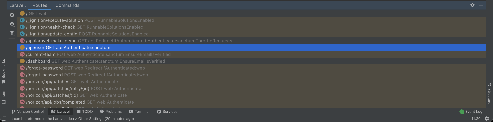
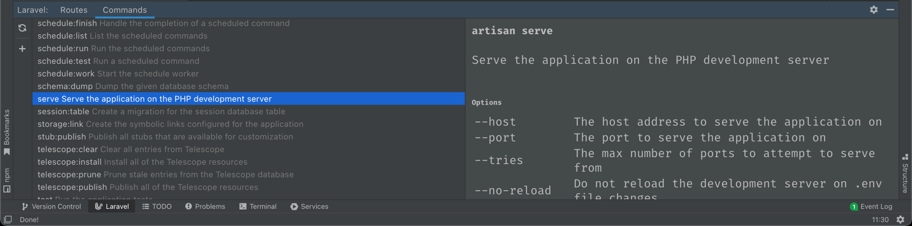

# Tool windows

When opening a Laravel project you should see a little "Laravel" entry right 
above the status bar at the bottom of your screen. If you open it, you get 
access to various tabs displaying information about your application.

## How it works

These tabs retrieve their information directly from your Laravel application, by
e.g. executing `php artisan route:list --format=json`. This is also why the 
plugin requires you to set up your PHP interpreter. The information if you did 
not visit the tab for a while, or manually by clicking on the refresh icon in 
the top right corner.

> As this boots up your application, make sure the booting process does not trigger any unwanted side effects!

If you have a syntax error in your source files, the executed artisan command 
will fail and the tab is unable to display any useful information. In this case,
just fix the syntax errors, and hit refresh. Usually you can also open a dialog
containing a detailed error message to get an idea where the syntax error might
originate from.

## Routes

The routes tab displays the output of `php artisan route:list`. It assigns an
icon, whether the route is handled by a closure (f), an invokable controller (c) 
or a controller method (m). It also highlights routes that do not originate from
your application in a different color (e.g. see the `/forgot-password` route
registered by Laravel Fortify).

If you don't care for these vendor routes, you are free to hide them using the
filters on the left. If you want to search for a specific route, just start 
writing while focusing the tool window and a search will automatically be 
performed.

By double-clicking or using the context menu you can navigate to the controller
or `FormRequest` of a given route.

## Commands

The commands tab displays the output of `php artisan list`. Use this tab to 
quickly find any commands in your application. When selecting a specific 
command, the `--help` output is displayed on the right, describing the available 
options, parameters and flags.