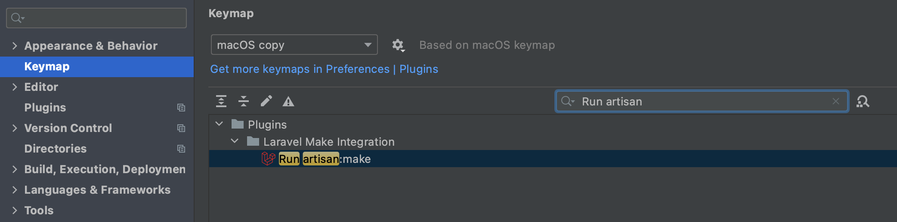
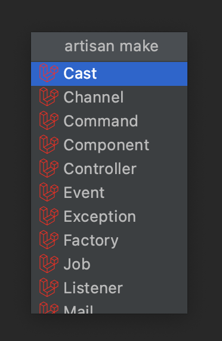
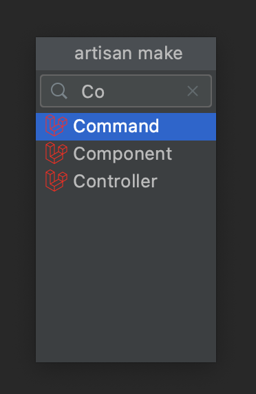

# Feature Overview

This serves as a complete list of the features / documentation this plugin provides.

## Contents

* [Awesome features of `artisan`](#awesome-features-of-artisan)
    + [🏳️‍🌈 Flags](#-flags)
    + [📝 Stub file support](#-stub-file-support)
* [Improvements over the CLI](#improvements-over-the-cli)
    + [🎯 Command Filtering](#-command-filtering)
    + [🤖 Auto filled namespaces](#-auto-filled-namespaces)
* [PHPStorm specific features](#phpstorm-specific-features)
    + [🐳 Remote Interpreters](#-remote-interpreters)

## Awesome features of `artisan`

Because this plugin internally executes `php artisan make`, a few features just work as you would expect.

### 🏳️‍🌈 Flags

You can pass every flag that is supported by the artisan sub-command of your choice. Just write all flags
*after* the name of the class you want to generate, and they will be passed along.

Just be aware that some flags trigger the cli to expect input (e.g. the `--parent` option for `make:controller`). This 
cannot be handled correctly at this moment, see #13 for more information. 

</img>

> Auto completion for these is also on the way, see #11

### 📝 Stub file support

As Laravel Make Integration is basically only a GUI for `php artisan make`, if you [customized the stub files](https://laravel.com/docs/artisan#stub-customization) or prefer [spaties defaults](https://github.com/spatie/laravel-stubs#opinionated-laravel-stubs) the code generation will just work as expected. No more fiddling with PHPStorm file templates needed and everyone one the team is using the same templates for file creation!

<!---------------------------------------------------------------------------->

## Improvements over the CLI

As we now do not work in the command line anymore, we can take advantage of several things that are not avaiable to
a terminal.

### 🎯 Command Filtering

If you right-click on the "app/Http" folder, you most likely want to generate a `Controller`,
`Middleware`, `Resource` or `Request`. Laravel Make Integration detects this and disables all other commands, in the 
dropdown to reduce the clutter.

> **Note:** You can always trigger the actions from anywhere by using the double-shift/search anything menu and
> search for the action. In this case, nothing will be filtered out based on your selection in the Project-view.

If you are a keyboard ninja you can also assign a shortcut to the `Run artisan:make`-action in the settings:

 
This opens up a small modal with all available `make`-commands, that can be filtered by typing:

| All commands | Filtered |
|--------------|----------|
||| 

### 🤖 Auto filled namespaces

It also **pre-fills the namespace** for the class to be generated. If you try to generate a new
`Controller` in a `A/Deeply/Nested/Namespace/In/Your/Controllers/Folder`, the input will already be pre-filled with the right
namespace, as you can see in the image below. Now the artisan command to be executed will contain the namespace,
so your new class will also be created in the `app/Http/Controllers/A/Deeply/Nested/Namespace/In/Your/Controllers/Folder`.

<!---------------------------------------------------------------------------->

## PHPStorm specific features

As Jetbrains already has a rich plugin ecosystem in place, we can take advantage of some of them. 

### 🐳 Remote Interpreters

If you are using Docker to run your local development environment, and you have specified path mappings for your project PHP interpreter, everything will just work fine (just make sure you have your path mappings setup). The extension uses the interpreter specified in the project settings, or the first local one it can find, if none is configured.

Because the IDE has to launch a Docker container in the background, which takes some time, you will see a popup like the one below, if you are using a remote interpreter.

</img>

